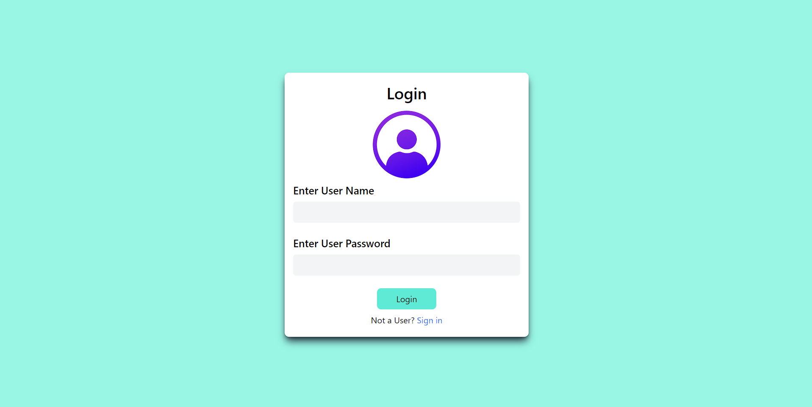
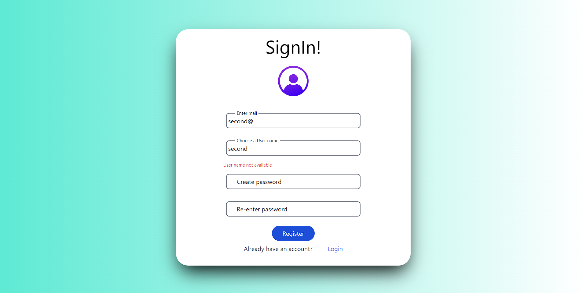
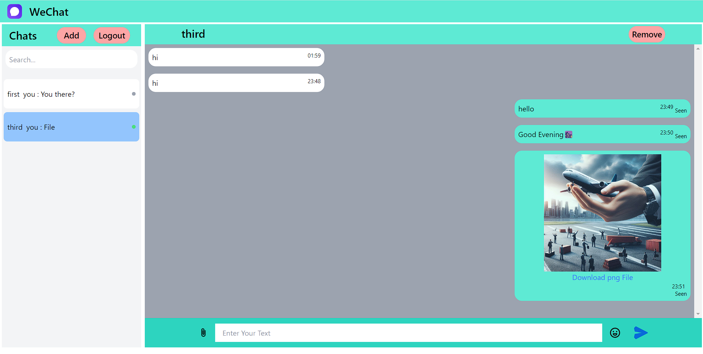
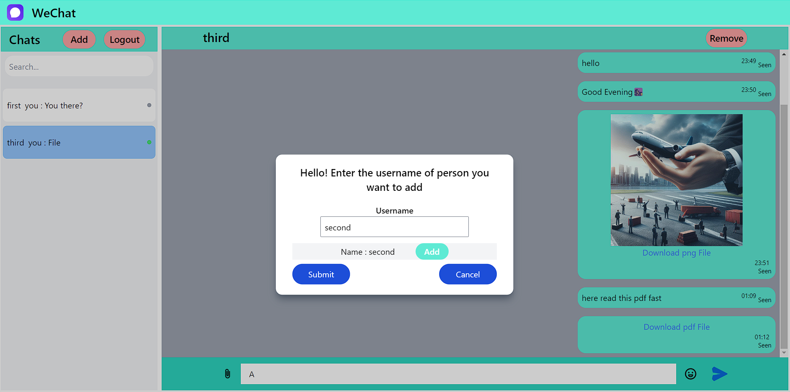
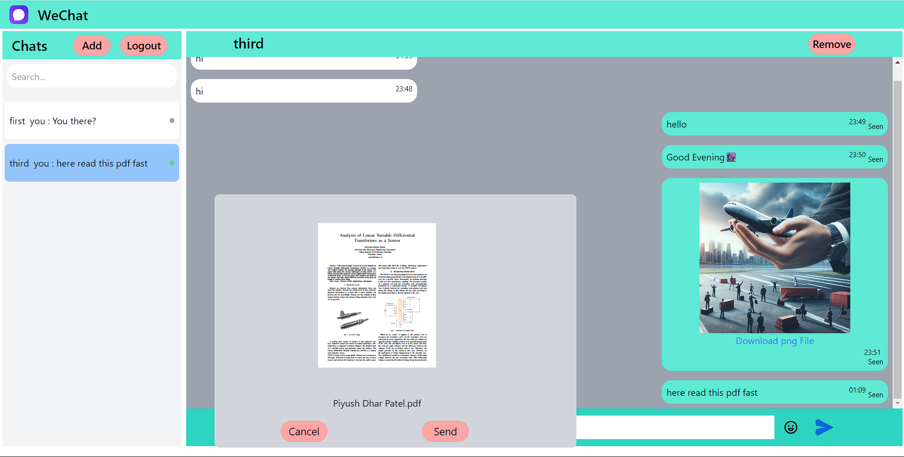
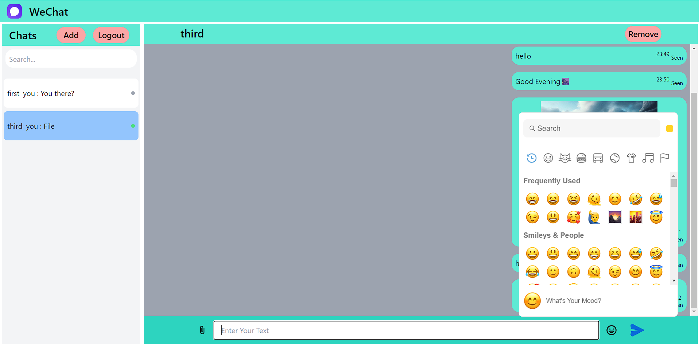
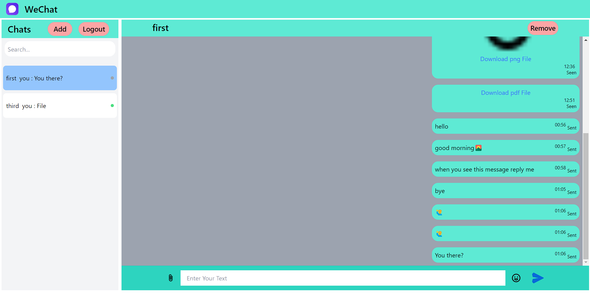

# Chat-Application
                                          Screenshots From Project

                                                Login Page

                                        

                                                Sign In Page

                                          

                                                  Chat Room

                                          

                                                Adding Friends

                                          

                                                File Preview Panel

                                          

                                                Sending Emoticons

                                          

                                            Sending Message to Offline users

                                            

INSTRUCTIONS FOR RUNNING THE SERVER IN LOCALHOST---

Before running the server/frontend--
1. In the frontend directory and backend directory, run the following command in terminal -: npm i
2. In the backend folder in configure folder in dbConnection.js file add your mongodb connection string
3. Enter your firebase api key and vapid key in the firebase file and firebase-messaging-sw file in frontend directory.
4. Replace the credentials in SAK.json file in backend with your correct firebase admin credentials.

To run the server--
1. Change the directory to backend
2. In the terminal type -: npx nodemon server

To run the frontend--
1. Change the directory to frontend
2. In the terminal type -: npm start
